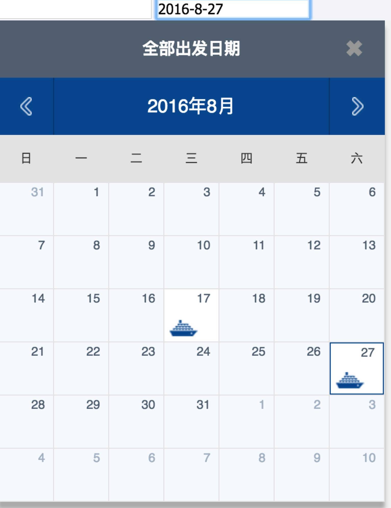

## Calendar

一个简单的Javascript日历控件，支持单双月暂时，以及自定义数据事件回调。日历只是一个简单的主体结构，可以按照自己具体需求进行对应修改，本身代码比较简单。

#### Options
```
{
	el:'.date', //日历对应dom
	monthNums:1/2, //单双月
	data:[{
		time: '2017-10-1'
	}], //自定义数据
    defaultDate: '', //默认起始日期
    dataTimeOpen: false,//是否以当前时间作为起始月
    callback:function(){
    }, //回调函数可以拿到日历dom
    createDataDom:function(){
    } //自定义数据绑定操作函数
 }
```

#### How to use
```
var c = new Calendar({
	el:'.date',
	monthNums:1,
	data:[{
		time:'2017-7-1',
		vid:''
	},{
		time:'2017-7-1',
		vid:''
	}]
	callback:function(obj){
	
	},
	createDataDom:function(){
	
	//默认有案例，可以参考
	}
})
```

#### Style

样式如下：
1. 单月


2.双月


#### Demo

请参考 [calendar.html](./calendar.html)